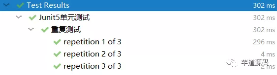

## 引入依赖
```xml
<dependency>
    <groupId>org.springframework.boot</groupId>
    <artifactId>spring-boot-starter-test</artifactId>
    <scope>test</scope>
    <!-- 防止使用旧的junit4相关接口我们将其依赖排除 -->
    <exclusions>
        <exclusion>
            <groupId>org.junit.vintage</groupId>
            <artifactId>junit-vintage-engine</artifactId>
        </exclusion>
    </exclusions>
</dependency>
```

## 常用注解
- @BeforeEach：在每个单元测试方法执行前都执行一遍
- @BeforeAll：在每个单元测试方法执行前执行一遍（只执行一次）
- @DisplayName("商品入库测试")：用于指定单元测试的名称
- @Disabled：当前单元测试置为无效，即单元测试时跳过该测试
- @RepeatedTest(n)：重复性测试，即执行n次
- @ParameterizedTest：参数化测试，
- @ValueSource(ints = {1, 2, 3})：参数化测试提供数据

## 测试service 
springboot 2.1.x之前版本，需要在测试类上添加@ExtendWith(SpringExtension.class)注解，否则无法生效
```java
@SpringBootTest
//@ExtendWith(SpringExtension.class)
class UserServiceTest {
    @Autowired
    UserService userService;

    @Test
    void deleteUser() {
        userService.deleteUser("1");
    }
}
```

## 断言
JUnit Jupiter提供了强大的断言方法用以验证结果，在使用时需要借助java8的新特性lambda表达式，均是来自org.junit.jupiter.api.Assertions包的static方法

assertTrue`与`assertFalse`用来判断条件是否为`true`或`false
```java
    @Test
    @DisplayName("测试断言equals")
    void testEquals() {
        assertTrue(3 < 4);
    }
```
assertNull`与`assertNotNull`用来判断条件是否为·`null
```java
    @Test
    @DisplayName("测试断言NotNull")
    void testNotNull() {
        assertNotNull(new Object());
    }
```
assertThrows用来判断执行抛出的异常是否符合预期，并可以使用异常类型接收返回值进行其他操作
```java
    @Test
    @DisplayName("测试断言抛异常")
    void testThrows() {
        ArithmeticException arithExcep = assertThrows(ArithmeticException.class, () -> {
            int m = 5/0;
        });
        assertEquals("/ by zero", arithExcep.getMessage());
    }
```
assertTimeout用来判断执行过程是否超时
```java
    @Test
    @DisplayName("测试断言超时")
    void testTimeOut() {
        String actualResult = assertTimeout(ofSeconds(2), () -> {
            Thread.sleep(1000);
            return "a result";
        });
        System.out.println(actualResult);
    }
```
assertAll是组合断言，当它内部所有断言正确执行完才算通过
```java
    @Test
    @DisplayName("测试组合断言")
    void testAll() {
        assertAll("测试item商品下单",
                () -> {
                    //模拟用户余额扣减
                    assertTrue(1 < 2, "余额不足");
                },
                () -> {
                    //模拟item数据库扣减库存
                    assertTrue(3 < 4);
                },
                () -> {
                    //模拟交易流水落库
                    assertNotNull(new Object());
                }
        );
    }
```

## 重复性测试
在许多场景中我们需要对同一个接口方法进行重复测试，例如对幂等性接口的测试。

JUnit Jupiter通过使用@RepeatedTest(n)指定需要重复的次数
```java
    @RepeatedTest(3)
    @DisplayName("重复测试")
    void repeatedTest() {
        System.out.println("调用");
    }
```


## 参数化测试
参数化测试可以按照多个参数分别运行多次单元测试这里有点类似于重复性测试，只不过每次运行传入的参数不同。  
需要使用到@ParameterizedTest，同时也需要@ValueSource提供一组数据，它支持八种基本类型以及String
和自定义对象类型，使用极其方便。
```java
    @ParameterizedTest
    @ValueSource(ints = {1, 2, 3})
    @DisplayName("参数化测试")
    void paramTest(int a) {
        assertTrue(a > 0 && a < 4);
    }
```

## 内嵌测试
JUnit5提供了嵌套单元测试的功能，可以更好展示测试类之间的业务逻辑关系，我们通常是一个业务对应一个测试类，有业务关系的类其实可以写在一起。  
这样有利于进行测试。而且内联的写法可以大大减少不必要的类，精简项目，防止类爆炸等一系列问题。
```java
@SpringBootTest
@AutoConfigureMockMvc
@DisplayName("Junit5单元测试")
public class MockTest {
    //....
    @Nested
    @DisplayName("内嵌订单测试")
    class OrderTestClas {
        @Test
        @DisplayName("取消订单")
        void cancelOrder() {
            int status = -1;
            System.out.println("取消订单成功,订单状态为:"+status);
        }
    }
}
```

