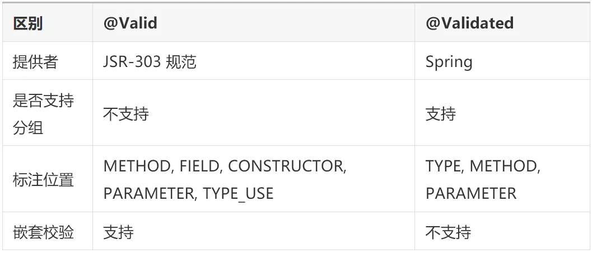

## JSR303框架Spring Validation

Java API 规范（JSR303）定义了 Bean 校验的标准 validation-api，但没有提供实现。  
Hibernate Validation 是对这个规范的实现，并增加了校验注解如 @Email、@Length等。  
Spring Validation 是对 Hibernate Validation 的二次封装，用于支持 Spring MVC 参数自动校验。接下来，我们以 spring-boot 项目为例，介绍 Spring Validation
的使用。

_**相关资料:**_
[JSR303常用注解含义](https://www.e-learn.cn/content/qita/2644564)  
[Hibernate Validation官方文档](http://hibernate.org/validator/documentation/)

### 引入依赖

spring-boot 版本小于 2.3.x，spring-boot-starter-web 会自动传入 hibernate-validator 依赖。 如果 spring-boot 版本大于2.3.x(包括2.3.x)
，则需要手动引入依赖：

```xml

<dependency>
    <groupId>org.springframework.boot</groupId>
    <artifactId>spring-boot-starter-validator</artifactId>
    <scope>compile</scope>
</dependency>
```

### 简单使用

对于 Web 服务来说，为防止非法参数对业务造成影响，在 Controller 层一定要做参数校验的！  
DTO 表示数据传输对象（Data Transfer Object），用于服务器和客户端之间交互传输使用的。在 spring-web 项目中可以表示用于接收请求参数的Bean对象。

大部分情况下，请求参数分为如下三种形式：

- POST、PUT 请求，使用 requestBody 传递参数；
- GET 请求，使用 requestParam/PathVariable 传递参数；

requestBody 参数校验  
在 DTO 字段上声明约束注解;  
只要给 DTO 对象加上 @Valid 或 @Validated 注解就能实现自动参数校验; 如果校验失败，会抛出 **MethodArgumentNotValidException** 异常， Spring 默认会将其转为 400（Bad
Request）请求。

- 在 DTO 字段上声明约束注解：

```java
@Data
public class UserDTO {
    private Long userId;

    @NotNull
    @Length(min = 2, max = 10)
    private String userName;

    @NotNull
    @Length(min = 6, max = 20)
    private String account;

    @NotNull
    @Length(min = 6, max = 20)
    private String password;
}
```

- 在方法参数上使用 @Valid 或 @Validated 声明校验注解：

```java
@PostMapping("/save")
public Result saveUser(@RequestBody @Validated UserDTO userDTO){
    // 校验通过，才会执行业务逻辑处理
    return Result.ok();
}
```

requestParam/PathVariable 参数校验

- 如果参数比较多(比如超过6个)，还是推荐使用 DTO 对象接收。此时和 requestBody 参数校验 一样；
- 否则，推荐将一个个参数平铺到方法入参中。在这种情况下，必须在 Controller 类上标注 @Validated 注解，并在入参上声明约束注解（如 @Min 等）。如果校验失败，会抛出
  ConstraintViolationException 异常。代码示例如下：

```java
@RequestMapping("/api/user")
@RestController
@Validated
public class UserController {
    // 路径变量
    @GetMapping("{userId}")
    public Result detail(@PathVariable("userId") @Min(10000000000000000L) Long userId) {
        // 校验通过，才会执行业务逻辑处理
        UserDTO userDTO = new UserDTO();
        userDTO.setUserId(userId);
        userDTO.setAccount("11111111111111111");
        userDTO.setUserName("xixi");
        userDTO.setAccount("11111111111111111");
        return Result.ok(userDTO);
    }

    // 查询参数
    @GetMapping("getByAccount")
    public Result getByAccount(@Length(min = 6, max = 20) @NotNull String account) {
        // 校验通过，才会执行业务逻辑处理
        UserDTO userDTO = new UserDTO();
        userDTO.setUserId(10000000000000003L);
        userDTO.setAccount(account);
        userDTO.setUserName("xixi");
        userDTO.setAccount("11111111111111111");
        return Result.ok(userDTO);
    }
}
```

### 进阶使用

#### 分组校验

在实际项目中，可能多个方法需要使用同一个 DTO 类来接收参数，而不同方法的校验规则很可能是不一样的。  
这个时候，简单地在 DTO 类的字段上加约束注解无法解决这个问题。因此，spring-validation 支持了分组校验的功能，专门用来解决这类问题。  
还是上面的例子，比如保存 User 的时候，UserId 是可空的，但是更新 User 的时候，UserId的值必须 >= 10000000000000000L；其它字段的校验规则在两种情况下一样。这个时候使用分组校验的代码示例如下：

- 约束注解上声明适用的分组信息 groups：

```java
@Data
public class UserDTO {
    @Min(value = 10000000000000000L, groups = Update.class)
    private Long userId;

    @NotNull(groups = {Save.class, Update.class})
    @Length(min = 2, max = 10, groups = {Save.class, Update.class})
    private String userName;

    @NotNull(groups = {Save.class, Update.class})
    @Length(min = 6, max = 20, groups = {Save.class, Update.class})
    private String account;

    @NotNull(groups = {Save.class, Update.class})
    @Length(min = 6, max = 20, groups = {Save.class, Update.class})
    private String password;

    /**
     * 保存的时候校验分组
     */
    public interface Save {
    }

    /**
     * 更新的时候校验分组
     */
    public interface Update {
    }
}
```

- @Validated 注解上指定校验分组：

```java
@PostMapping("/save")
public Result saveUser(@RequestBody @Validated(UserDTO.Save.class) UserDTO userDTO){
    // 校验通过，才会执行业务逻辑处理
    return Result.ok();
}

@PostMapping("/update")
public Result updateUser(@RequestBody @Validated(UserDTO.Update.class) UserDTO userDTO){
    // 校验通过，才会执行业务逻辑处理
    return Result.ok();
}
```

#### 嵌套校验

前面的示例中，DTO 类里面的字段都是基本数据类型和 String 类型。  
但是实际场景中，有可能某个字段也是一个对象，这种情况先，可以使用嵌套校验。  
比如，上面保存User信息的时候同时还带有 Job 信息。需要注意的是，此时

- DTO 类的对应字段必须标记 @Valid 注解。

```java
@Data
public class UserDTO {
    @Min(value = 10000000000000000L, groups = Update.class)
    private Long userId;

    @NotNull(groups = {Save.class, Update.class})
    @Length(min = 2, max = 10, groups = {Save.class, Update.class})
    private String userName;

    @NotNull(groups = {Save.class, Update.class})
    @Length(min = 6, max = 20, groups = {Save.class, Update.class})
    private String account;

    @NotNull(groups = {Save.class, Update.class})
    @Length(min = 6, max = 20, groups = {Save.class, Update.class})
    private String password;

    @NotNull(groups = {Save.class, Update.class})
    @Valid
    private Job job;

    @Data
    public static class Job {

        @Min(value = 1, groups = Update.class)
        private Long jobId;

        @NotNull(groups = {Save.class, Update.class})
        @Length(min = 2, max = 10, groups = {Save.class, Update.class})
        private String jobName;

        @NotNull(groups = {Save.class, Update.class})
        @Length(min = 2, max = 10, groups = {Save.class, Update.class})
        private String position;
    }

    /**
     * 保存的时候校验分组
     */
    public interface Save {
    }

    /**
     * 更新的时候校验分组
     */
    public interface Update {
    }
}
```

**嵌套校验可以结合分组校验一起使用。还有就是嵌套集合校验会对集合里面的每一项都进行校验，例如 List<Job> 字段会对这个list里面的每一个 Job 对象都进行校验。**

#### 集合校验

如果请求体直接传递了 JSON 数组给后台，并希望对数组中的每一项都进行参数校验。  
此时，如果我们直接使用 java.util.Collection 下的 List 或者 Set 来接收数据，参数校验并不会生效！我们可以使用自定义list集合来接收参数。

- 如果校验不通过，会抛出 **_NotReadablePropertyException_**，同样可以使用统一异常进行处理。
- 包装 List 类型，并声明 @Valid 注解：

```java
public class ValidationList<E> implements List<E> {
    @Delegate // @Delegate是lombok1.18.6 以上版本注解
    @Valid // 一定要加@Valid注解
    public List<E> list = new ArrayList<>();

    // 一定要记得重写toString方法
    @Override
    public String toString() {
        return list.toString();
    }
}
```

- 比如，我们需要一次性保存多个 User 对象，Controller 层的方法可以这么写：

```java
@PostMapping("/saveList")
public Result saveList(@RequestBody @Validated(UserDTO.Save.class) ValidationList<UserDTO> userList){
    // 校验通过，才会执行业务逻辑处理
    return Result.ok();
}
```

#### 自定义校验

业务需求总是比框架提供的这些简单校验要复杂的多，我们可以自定义校验来满足我们的需求。 自定义 Spring Validation 非常简单， 假设我们自定义加密 id（由数字或者 a-f 的字母组成，32-256 长度）校验，主要分为两步。

- 自定义约束注解：

```java
@Target({METHOD, FIELD, ANNOTATION_TYPE, CONSTRUCTOR, PARAMETER})
@Retention(RUNTIME)
@Documented
@Constraint(validatedBy = {EncryptIdValidator.class})
public @interface EncryptId {
    // 默认错误消息
    String message() default "加密id格式错误";

    // 分组
    Class<?>[] groups() default {};

    // 负载
    Class<? extends Payload>[] payload() default {};
}
```

- 实现 ConstraintValidator 接口编写约束校验器：

```java
public class EncryptIdValidator implements ConstraintValidator<EncryptId, String> {
    private static final Pattern PATTERN = Pattern.compile("^[a-f\\d]{32,256}$");

    @Override
    public boolean isValid(String value, ConstraintValidatorContext context) {
        // 不为null才进行校验
        if (value != null) {
            Matcher matcher = PATTERN.matcher(value);
            return matcher.find();
        }
        return true;
    }
}
```

这样我们就可以使用 @EncryptId 进行参数校验了！

#### 编程式校验

上面的示例都是基于注解来实现自动校验的，在某些情况下，我们可能希望以编程方式调用验证。  
这个时候可以注入 javax.validation.Validator 对象，然后再调用其 API。

```java
@Autowired
private javax.validation.Validator globalValidator;

// 编程式校验
@PostMapping("/saveWithCodingValidate")
public Result saveWithCodingValidate(@RequestBody UserDTO userDTO){
    Set<ConstraintViolation<UserDTO>>validate=globalValidator.validate(userDTO,UserDTO.Save.class);
    // 如果校验通过，validate为空；否则，validate包含未校验通过项
    if(validate.isEmpty()){
        // 校验通过，才会执行业务逻辑处理
        
    }else{
      for(ConstraintViolation<UserDTO> userDTOConstraintViolation:validate){
        // 校验失败，做其它逻辑
        System.out.println(userDTOConstraintViolation);
      }
    }
    return Result.ok();
}
```

#### 快速失败（Fail Fast）

Spring Validation 默认会校验完所有字段，然后才抛出异常。  
可以通过一些简单的配置，开启 Fali Fast 模式，一旦校验失败就立即返回。

```java
@Bean
public Validator validator(){
    ValidatorFactory validatorFactory=Validation.byProvider(HibernateValidator.class)
    .configure()
    // 快速失败模式
    .failFast(true)
    .buildValidatorFactory();
    return validatorFactory.getValidator();
}
```

#### @Valid 和 @Validated 区别



### 实现原理

#### requestBody 参数校验实现原理

在 spring-mvc 中，RequestResponseBodyMethodProcessor 是用于解析 @RequestBody 标注的参数以及处理 @ResponseBody
标注方法的返回值的。显然，执行参数校验的逻辑肯定就在解析参数的方法 resolveArgument() 中：

```java
public class RequestResponseBodyMethodProcessor extends AbstractMessageConverterMethodProcessor {
    @Override
    public Object resolveArgument(MethodParameter parameter, @Nullable ModelAndViewContainer mavContainer,
                                  NativeWebRequest webRequest, @Nullable WebDataBinderFactory binderFactory) throws Exception {
        parameter = parameter.nestedIfOptional();
        //将请求数据封装到DTO对象中
        Object arg = readWithMessageConverters(webRequest, parameter, parameter.getNestedGenericParameterType());
        String name = Conventions.getVariableNameForParameter(parameter);

        if (binderFactory != null) {
            WebDataBinder binder = binderFactory.createBinder(webRequest, arg, name);
            if (arg != null) {
                // 执行数据校验
                validateIfApplicable(binder, parameter);
                if (binder.getBindingResult().hasErrors() && isBindExceptionRequired(binder, parameter)) {
                    throw new MethodArgumentNotValidException(parameter, binder.getBindingResult());
                }
            }
            if (mavContainer != null) {
                mavContainer.addAttribute(BindingResult.MODEL_KEY_PREFIX + name, binder.getBindingResult());
            }
        }
        return adaptArgumentIfNecessary(arg, parameter);
    }
}
```

可以看到，resolveArgument() 调用了 validateIfApplicable() 进行参数校验。

```java
protected void validateIfApplicable(WebDataBinder binder, MethodParameter parameter) {
      // 获取参数注解，比如@RequestBody、@Valid、@Validated
      Annotation[] annotations = parameter.getParameterAnnotations();
      for (Annotation ann : annotations) {
          // 先尝试获取@Validated注解
          Validated validatedAnn = AnnotationUtils.getAnnotation(ann, Validated.class);
          //如果直接标注了@Validated，那么直接开启校验。
          //如果没有，那么判断参数前是否有Valid起头的注解。
          if (validatedAnn != null || ann.annotationType().getSimpleName().startsWith("Valid")) {
              Object hints = (validatedAnn != null ? validatedAnn.value() : AnnotationUtils.getValue(ann));
              Object[] validationHints = (hints instanceof Object[] ? (Object[]) hints : new Object[] {hints});
              //执行校验
              binder.validate(validationHints);
              break;
          }
      }
}
```

看到这里，大家应该能明白为什么这种场景下 @Validated、@Valid 两个注解可以混用。  
我们接下来继续看 WebDataBinder.validate() 实现。
```java
@Override 
public void validate(Object target, Errors errors, Object... validationHints) { 
    if (this.targetValidator != null) { 
        processConstraintViolations(
            //此处调用Hibernate Validator执行真正的校
            this.targetValidator.validate(target, asValidationGroups(validationHints)), errors); 
    }
}
```
最终发现底层最终还是调用了 Hibernate Validator 进行真正的校验处理。

#### 方法级别的参数校验实现原理
上面提到的将参数一个个平铺到方法参数中，然后在每个参数前面声明约束注解的校验方式，就是方法级别的参数校验。  
实际上，这种方式可用于任何 Spring Bean 的方法上，比如 Controller/Service 等。  
其底层实现原理就是AOP，具体来说是通过 MethodValidationPostProcessor 动态注册 AOP 切面，然后使用 MethodValidationInterceptor 对切点方法织入增强。

```java
public class MethodValidationPostProcessor extends AbstractBeanFactoryAwareAdvisingPostProcessorimplements InitializingBean {
    @Override
    public void afterPropertiesSet() {
        //为所有`@Validated`标注的Bean创建切面
        Pointcut pointcut = new AnnotationMatchingPointcut(this.validatedAnnotationType, true);
        //创建Advisor进行增强
        this.advisor = new DefaultPointcutAdvisor(pointcut, createMethodValidationAdvice(this.validator));
    }

    //创建Advice，本质就是一个方法拦截器
    protected Advice createMethodValidationAdvice(@Nullable Validator validator) {
        return (validator != null ? new MethodValidationInterceptor(validator) : new MethodValidationInterceptor());
    }
}
```

接着看一下 MethodValidationInterceptor：
```java

public class MethodValidationInterceptor implements MethodInterceptor {
    @Override
    public Object invoke(MethodInvocation invocation) throws Throwable {
        //无需增强的方法，直接跳过
        if (isFactoryBeanMetadataMethod(invocation.getMethod())) {
            return invocation.proceed();
        }
        //获取分组信息
        Class<?>[] groups = determineValidationGroups(invocation);
        ExecutableValidator execVal = this.validator.forExecutables();
        Method methodToValidate = invocation.getMethod();
        Set<ConstraintViolation<Object>> result;
        try {
            //方法入参校验，最终还是委托给Hibernate Validator来校验
            result = execVal.validateParameters(
                invocation.getThis(), methodToValidate, invocation.getArguments(), groups);
        }
        catch (IllegalArgumentException ex) {
            ...
        }
        //有异常直接抛出
        if (!result.isEmpty()) {
            throw new ConstraintViolationException(result);
        }
        //真正的方法调用
        Object returnValue = invocation.proceed();
        //对返回值做校验，最终还是委托给Hibernate Validator来校验
        result = execVal.validateReturnValue(invocation.getThis(), methodToValidate, returnValue, groups);
        //有异常直接抛出
        if (!result.isEmpty()) {
            throw new ConstraintViolationException(result);
        }
        return returnValue;
    }
}
```

实际上，不管是 requestBody 参数校验还是方法级别的校验，最终都是调用 Hibernate Validator 执行校验，Spring Validation 只是做了一层封装。

项目源码
https://github.com/chentianming11/spring-validation